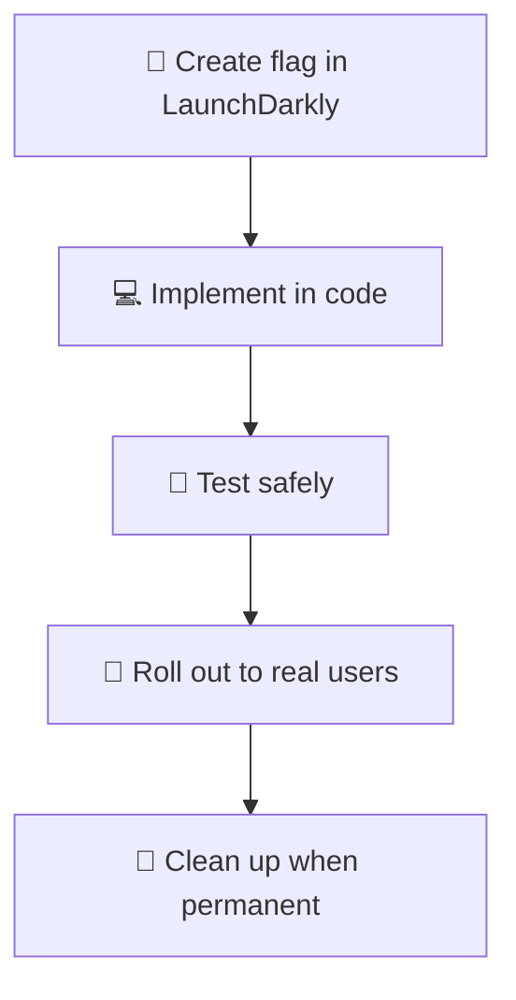
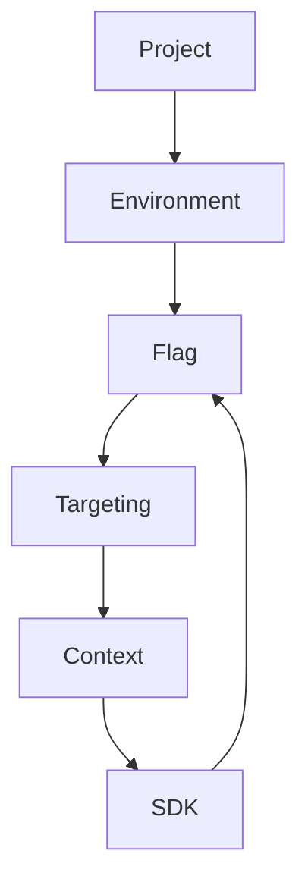

<style>
.spacious h1, .spacious h2, .spacious h3 {
  margin-bottom: 2.5rem;
}
.spacious ul, .spacious ol {
  font-size: 1.25em;
  margin-top: 1.5rem;
}
.spacious li {
  margin-bottom: 0.7em;
}
</style>

# Feature Flags in Practice  
### with LaunchDarkly  
_Deploy faster, release safer_

<!--
- Welcome, everyone!
- Today, we're going to dive into the practical side of feature flags—how they work, why they matter, and how you can use them to deploy faster and release safer.
- We'll be focusing on LaunchDarkly, one of the leading platforms for feature flag management.
- Whether you're new to feature flags or looking to level up your rollout strategies, you'll leave with actionable insights and real-world examples.
- Let's get started!
-->

---

## What Are Feature Flags?

<br>

> A feature flag is a conditional check in your code that controls access to a feature.

<br>

```python
if launchdarkly_client.variation("new-feature", user, False):
    show_new_thing()
else:
    show_old_thing()
```

<!--
- A feature flag is simply a conditional statement in your code that determines whether a feature is enabled or not.
- Think of it like a light switch: you can turn a feature on or off instantly, without changing the wiring (your codebase) or calling an electrician (your dev team).
- This lets you control who sees a feature and when, without redeploying code—great for business agility.
- In the code example, the flag decides if a user gets the new or old experience. This is the foundation for gradual rollouts, experiments, and safer releases.
- Both technical teams and business stakeholders benefit: engineers get flexibility, and product can manage features in real time.
-->

---
layout: image
image: https://openfeature.dev/assets/images/ff-service-9bfd5d029bfcd0ebbea6c6cab79b6a14.png
backgroundSize: contain
---

---

## Why Feature Flags?

<br>

- 🚀 **Decouple** deploy from release  
- 🦺 Enable **canary rollouts** and **kill switches**  
- 🧪 Test in production safely  
- 👩‍💻 Empower non-devs to control features  
- ⚡ Move faster with less risk

<!--
- Feature flags let us ship code to production without exposing it to users right away. This decouples deployment from release.
- We can do canary rollouts—gradually enabling features for a subset of users—and quickly disable them if issues arise.
- Testing in production becomes safer, as we can validate features with real users before a full launch.
- Non-developers, like product managers, can control feature availability without engineering help.
- All of this means we can innovate faster, but with less risk.
-->

---
layout: image
image: https://spacecamp.launchdarkly.com/images/arch.png
backgroundSize: contain
---

---

## Flag Templates in LaunchDarkly

LaunchDarkly provides several flag templates to streamline feature flag setup:

| Type        | What it's for                        | Key characteristics                                 | When to use                                   |
|-------------|--------------------------------------|-----------------------------------------------------|-----------------------------------------------|
| Custom      | General/uncommon use cases           | Fully configurable, uses project defaults           | When you need flexibility or a unique setup   |
| Release     | Gradual rollout of new features      | Temporary, boolean (Available/Unavailable)          | Remove after full rollout                     |
| Kill Switch | Emergency disable of components      | Permanent, boolean (Enabled/Disabled), automatable  | For safety switches, quick disables           |
| Experiment  | Testing hypotheses (A/B/C)           | Temporary, boolean or multivariate, metrics paired  | For experiments, feature tests, A/B testing   |

<!--
Concise:
- Templates standardize flag setup for common use cases
- Choose the template that matches your goal (release, kill switch, experiment, or custom)

Details:
- LaunchDarkly flag templates help you quickly create flags with the right defaults for your use case.
- Custom flags are fully flexible, but use project-level defaults—best for unique or advanced needs.
- Release flags are for gradual rollouts; they're temporary and should be removed after launch.
- Kill switch flags are permanent and let you quickly disable risky or failing components—great for safety.
- Experiment flags are for A/B or multivariate testing, often paired with metrics to measure impact.
- Using templates helps keep your flag system organized and consistent, and makes it easier for teams to follow best practices.
-->

---

## Risks of Feature Flags

❌ **Tech debt**: old flags never removed  
_Mitigation: Regularly review and clean up unused flags_
<br>
<br>
⚠️ **Code complexity**: logic becomes harder to follow  
_Mitigation: Keep flag logic simple and well-documented_
<br>
<br>
🔍 **Observability gaps**: harder to trace behavior  
_Mitigation: Add logging and monitoring for flag usage_
<br>
<br>
🔒 **Security**: flag names or values can leak logic  
_Mitigation: Avoid sensitive info in flag names/values_

<!--
- These risks are important, but all have solutions with good practices.
- Personal anecdote: In a previous engagement, I saw feature flags that were never cleaned up. This not only made the code harder to read, but also added overhead—LaunchDarkly SDKs were still making requests and evaluations for those stale flags, which can have a real cost.
- The key is to regularly review and remove unused flags, keep logic simple, monitor flag usage, and avoid putting sensitive info in flag names or values.
- With these practices, feature flags remain a powerful and safe tool.
-->

---

## Feature Flag Lifecycle

<div align="center">

</div>

---
layout: two-cols
---

## LaunchDarkly Basics

<br>

- **Project**: Logical grouping of flags  
- **Environment**: Dev, staging, prod (separate settings per project/env)  
- **Flag**: Toggle with one or more variations  
- **Context**: Data object representing users, devices, orgs, etc. for targeting  
- **Targeting**: Rules to deliver specific variations to different contexts  
- **SDKs**: Server/client integrations in many languages

::right::

<div align="center">

</div>

<!--
Concise:
- Project > Environment > Flag > Context > Targeting > SDKs
- Contexts are key for advanced targeting
- These pieces fit together to control feature delivery

Details:
- Projects are like organizational units—each holds environments (dev, staging, prod, etc.).
- Environments let you separate settings and flags for different stages.
- Flags are the toggles you use to control features.
- Contexts represent the entities you target: users, devices, organizations, etc.
- Targeting uses context attributes to decide who gets which flag variation.
- SDKs connect your app to LaunchDarkly, evaluating flags in real time.
- All these pieces work together: you define flags in a project/environment, target them to specific contexts, and your app uses the SDK to check flag values.
- We'll see a practical example of this flow on the next slide.
-->

---

## Anatomy of a Flag

<br>

- **Key**: `new_checkout_experience`  
- **Type**: Boolean (e.g., `true`/`false`), String (e.g., `"A"`/`"B"`), JSON (e.g., `{ "color": "blue" }`)  
- **Variations**: The possible values for the flag (e.g., `true`, `false`, or multiple strings/objects)  
- **Targeting rules**: Deliver different variations to different users/contexts based on attributes—this is what makes flags so powerful!

<!--
Concise:
- Key, type, variations, targeting rules
- Targeting is what makes flags dynamic

Details:
- Every flag has a key (its unique name), a type (Boolean, string, or JSON), and a set of possible variations.
- Variations are the values your code will see—could be as simple as true/false, or more complex like a JSON object.
- Targeting rules let you deliver different flag variations to different users or groups, based on their attributes—this is where the real power and flexibility comes in.
- All these components work together to let you control feature delivery with precision.
-->

---

## Best Practices

<br>

| What                                 | Why                                         | How/Example                                 |
|-------------------------------------- |---------------------------------------------|---------------------------------------------|
| Use clear, instructional flag names   | Clarifies purpose and scope                 | Name: `Release: widget API`                 |
| Use consistent flag keys              | Keys are permanent, used in code            | Key: `release-widget-api`                   |
| Set and document default values       | Prevents surprises and clarifies intent     | Default: `false` in dev, `true` in prod     |
| Add expiration/owner in description   | Ensures accountability and cleanup          | "Expires: 2024-12-31, Owner: @alice"        |
| Test flag logic like regular code     | Flags create new code paths—test them!      | Add unit/integration tests for both paths   |

<!--
Concise:
- Use clear names and keys (note: names vs. keys)
- Document defaults, owners, and expirations
- Clean up flags quickly
- Test all flag logic
- Use templates for consistency

Details:
- Flag names should read as instructional sentences, starting with an action and ending with a subject (e.g., "Release: widget API").
- Flag keys are permanent, used in code, and typically match the name with formatting changes (e.g., `Release: widget API` becomes `release-widget-api`).
- Use consistent key conventions (e.g., kebab-case, with prefixes) for standardization and easier code reference.
- Document default values and intended environments to avoid surprises.
- Assign owners and expiration dates to ensure someone is responsible for cleanup.
- Remove temporary flags as soon as they're no longer needed.
- Test all code paths created by flags.
- Use flag templates and naming conventions to standardize across your org.
-->

---

## When NOT to Use Flags

<br>

| What                        | Why                                                        | How/Alternative                         |
|-----------------------------|------------------------------------------------------------|-----------------------------------------|
| Secrets management          | Flags are not secure; can leak sensitive info              | Use a secrets manager                   |
| Rarely changed config       | Flags add unnecessary complexity                           | Use config management                   |
| Critical startup config     | App may not start if flag is off                           | Use config files or environment vars    |
| Database or file store      | Flags are not for storing data; can get complex/slow       | Use a database or file storage system   |
| Every small change          | Too much overhead; not worth the cost                      | Flag features or major behaviors only   |

<!--
Concise:
- Don't use flags for secrets, static config, or as a data store
- Only flag features that need dynamic control

Details:
- Feature flags are powerful, but not for everything.
- Never use flags for secrets or credentials—use a secrets manager.
- For static or rarely changed config, use your config management system.
- Don't use flags for critical startup config (like DB hostnames)—if the flag is off, your app might not start.
- Avoid using flags as a database or file store; keep variations simple.
- Don't flag every tiny change—focus on features or behaviors that need runtime control.
-->

---
layout: two-cols

---

## Parallel Change

You can use the **_Parallel Change_** pattern with or without feature flags. Sometimes, a flag adds unnecessary complexity—use your judgment!

**The How:**
- **Expand:** Add the new version alongside the old one.
- **Migrate:** Gradually update all clients/references to use the new version (feature flags can help, but aren't always required).
- **Contract:** Remove the old version after migration to avoid tech debt.

::right::
<br>

**Common Applications:**
- 🔄 Refactoring APIs or method signatures
- 🗄️ Schema changes in DB migrations
- 🟦 Canary or blue/green deployments
- 🌐 Evolving remote APIs (e.g. REST)

**Tradeoffs & Tips:**
- 🕰️ Maintain both versions during migration
- 🏁 Requires discipline to finish contract phase
- 📚 Good docs/flags help reduce confusion
- 🧹 Clean up old code to avoid tech debt


---

## Key Takeaways
<br>

- Feature flags decouple deployment from release and enable safer, faster rollouts.
- Use flags for dynamic, temporary control—not for everything.
- Clean up old flags to avoid tech debt and complexity.
- Standardize naming, ownership, and testing for maintainability.
- LaunchDarkly provides tools and templates to help you scale flag management.
- Patterns like parallel change make big refactors safer with flags.
  - However, you can use parallel change without flags!

---

## Questions So Far?

<br>

_Ask anything about theory, rollout, lifecycle, or architecture!_

---

## Live Demo: Overview

<br>

- Flask-based RESTful API  
- One flag: `show_bonus_content`  
- Watch the app change in real time when we flip the flag!
